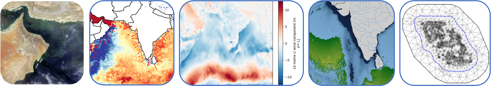

Welcome to the NOAA Fisheries HackDays focused on geospatial analysis using ocean 'big data'.

## Links

* GitHub repo: <https://github.com/nmfs-opensci/NOAAHackDays-2024>
* JupyterHub: <https://dhub.opensci.live/>
* Discussions: <https://github.com/orgs/nmfs-opensci/discussions>
<!-- * Slack: <https://app.slack.com/client/T05PV2USY56/C05P7QP47UL> -->
